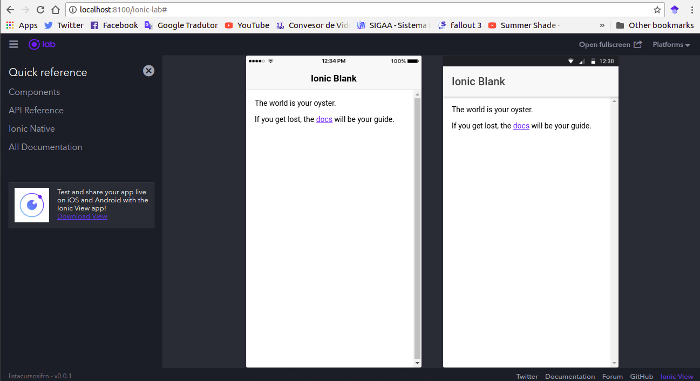

Olá terráqueos, neste primeiro post vamos ver como instalar e criar nosso primeiro app utilizando o Ionic 3. O Ionic, caso você não conheça, é um framework para desenvolvimento de aplicações móveis híbridas, de forma rápida e de fácil aprendizado. 

**1. Configurando o ambiente** 

Para instalar o Ionic você vai precisar ter instalado o Node e o npm, você pode fazer isso baixando o Node [aqui](https://nodejs.org/en/). 

Se você está utilizando Linux, pode fazer a instalação por meio do apt-get, basta executar os comandos abaixo: 

```
sudo apt-get update
sudo apt-get install nodejs
sudo apt-get install npm
```

Se quiser, você também pode ver um tutorial mais completo da instalação, nesse link [aqui](https://www.digitalocean.com/community/tutorials/como-instalar-o-node-js-no-ubuntu-16-04-pt), é um tutorial da DigitalOcean, bastante detalhado e com outras opções de download além do apt. 

Depois de instalado o Node e o npm você vai precisar instalar o Ionic CLI e o Cordova, para isso execute o comando abaixo: 

```
npm install -g ionic cordova
```
>O -g presente no comando, indica que essa vai ser uma instalação global, por isso é necessário adicionar sudo ao comando, caso esteja no Linux ou Mac, ou abrir o cmd como administrador caso esteja no Windows.

Pronto, se você conseguiu instalar tudo o que precisa, agora você está pronto para criar seu primeiro app com Ionic e é isso que vamos fazer no tópico 2. :-D 

Antes de criar o app, você vai precisar possuir intalado um editor de texto na sua máquina, instale o da sua preferência, até onde sei os mais famosos são Sublime Text, Visual Studio Code e Atom, sinta se a vontade para usar qualquer um dos três. Abaixo vou listar os links para download de cada um, além de um link com instruções para instalação no Linux. No Windows a instalação de todos é tão simples que nem precisa de link. :-D

1. Visual Studio Code 
	* [Download](https://code.visualstudio.com)
	* [Instalação](https://code.visualstudio.com/docs/setup/linux)
2. Atom 
	* [Download](https://atom.io)
	* [Instalação](https://flight-manual.atom.io/getting-started/sections/installing-atom/#platform-linux)
3. Sublime Text
	* [Download](https://www.sublimetext.com/3)
	* [Instalação no Linux](https://www.omgubuntu.co.uk/2017/05/how-to-install-sublime-text-ubuntu-linux)
 
**2. Criando nosso primeiro app**

O Ionic por padrão já possui alguns templates que podemos usar para criar nosso projeto, vamos usar o blank que é o mais simples, mas caso tenha interesse, [aqui](https://ionicframework.com/docs/cli/starters.html) você pode encontrar mais detalhes de todos os templates disponíveis. 

Para criar o projeto, execute o comando abaixo: 
```
ionic start nome_app blank
```
Troque "nome_app" por um nome de sua prefêrencia, esse vai ser o nome do seu projeto.

Agora que você já criou sua app, é bem provável que você deseje ver como ela está no momento, para isso execute o comando abaixo: 

```
ionic serve --lab
```

Ao fim da execução uma janela do seu navegador padrão será aberta, por padrão no meu caso, a janela exibiu a versão de iOS, mas caso queira ver a versão de Android ou as duas ao mesmo tempo, você deve acessar o menu Plataforms, e marcar às caixas dos sistemas que deseja ver, marcando iOS e Android você deve estar vendo algo como o da imagem abaixo: 

 

Chegamos ao fim dessa primeira parte, vimos ai que com alguns comandos conseguimos instalar o Ionic e criar nosso primeiro app. No próximo post vamos ver como melhorar essa nossa primeira tela, que está bem sem graça atualmente, sendo assim, até próxima pessoal. 