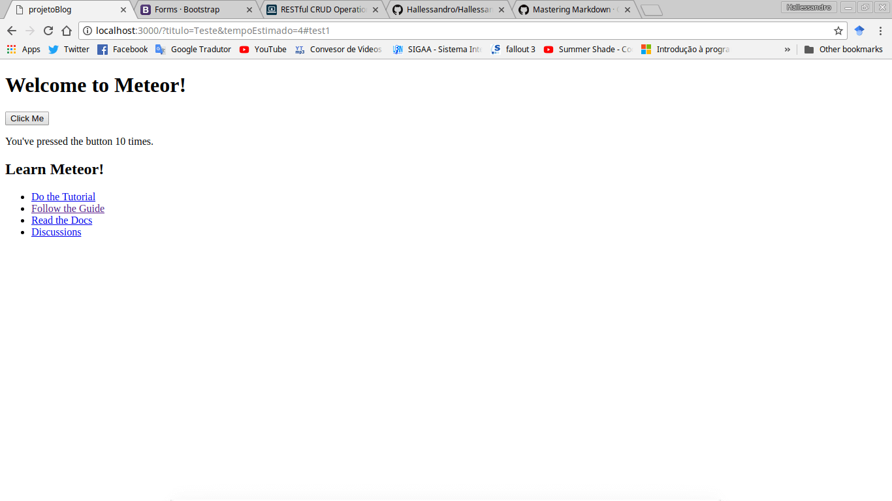
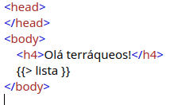
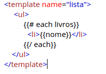
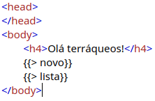

Olá terráqueos, faz um bom tempo que não posto nada novo, muito pelo fato que ultimamente não vinha trabalhando com coisas novas. Porém isso mudou nos últimos dias graças ao Meteor. Se você não sabe o que é, assim como eu não sabia, você precisa conhecer. 

Se você acessar a página do Meteor, [aqui](https://www.meteor.com/), você vai encontrar a seguinte descrição "THE FASTEST WAY TO BUILD JAVASCRIPT APPS", mas o que isso quer dizer?
 
Rapaz, o negócio é realmente rápido, primeiro de tudo é que todo o seu código do back ao front vai ser desenvolvido em uma única linguagem, JavaScript. Segundo, nada de configurações chatas e complicadas, aqui nem o banco você precisa se preocupar em configurar, o Meteor já faz isso para você, quando você criar um projeto ele já vem com um MongoDB prontinho para uso. 

Algo que achei sensacional quandro criei meu projeto, é que não preciso criar classes de modelo duas vezes, algo bem comum quando se tem uma aplicação cliente/servidor. 

Um projeto Meteor é divido em duas pastas bases, client e server, tudo que você colocar em client vai ser utilizado pelo cliente e tudo que for em server pelo servidor. O grande truque aqui, é que tudo que for para ser usado tanto por client quanto por server, fica em diretórios na raiz do projeto, fora de client e server. Assim tanto client quanto server conseguem visualizar e utilizar seu conteúdo. 

Instalar e criar um projeto também é bem simples, basta apenas seguir os passos abaixo: 

> Para Windows é necessário ter instalado o Chocolatey e então executar o comando abaixo: 
```
choco install meteor
```
> Para Linux e Mac é só executar: 
```
curl https://install.meteor.com/ | sh
```

Depois de instalado para criar o primeiro projeto basta executar: 
```
meteor create myapp
```
O processo de criação pode demorar alguns minutos, mas logo depois de finalizado é possível testar a aplicação, para isso siga os passos abaixo: 
```
cd myapp
meteor npm install
meteor
# Meteor server running on: http://localhost:3000/
```

Ao acessar o endereço informado pelo servidor, é possível ver uma simples aplicação como a apresentada na imagem abaixo. Apesar de simples ela é bem interessante pois mostra uma das coisas mais legais do Meteor, a capacidade de alterar o conteúdo sem precisar recarregar a página. Faça o teste, clique várias vezes no botão e veja o contador aumentar sem recarregar a página em momento algum. 

 

Depois de testar, abra o diretório do projeto criado no seu editor de texto preferido, e acesse o diretório client. Dentro dele existem três arquivos, eles são os responsáveis pelo exemplo que você viu quando rodou o projeto. Não vamos precisar mais deles então pode deletar. 

Agora é preciso criar o arquivo HTML base de tudo, para isso na raiz de client crie o arquivo index.html, dentro dele declare o código abaixo: 

```html
<head>
</head>
<body>
    <h4>Olá terráqueos!</h4>
</body>
```
Note que não há uma tag html nem declaração de doctype e tudo que um arquivo HTML5 normalmente tem, mas não se preocupe, o Meteor vai fazer isso por você. 

Agora vamos criar nosso primeiro componente. Um componente de modo geral é um carinha responsável por montar/gerenciar um pedaço especifico da tela, algo como header, footer, sidemenu e por ai vai. O resultado final de uma aplicação é a utilização de vários componentes em conjunto. 

Para manter as coisas organizadas, dentro de client crie uma pasta chamada views e dentro de views crie outro diretório chamado lista. Já dentro de lista crie um arquivo lista.html que deve conter o código abaixo: 

```html
<template name="lista">
    <ul>
        <li>Teste</li>
        <li>Mais um teste</li>
    </ul>
</template>
```

Quando lidamos com aplicações Meteor, não é necessário rescrever todo HTML padrão em cada arquivo, lembra quando falei que um componente é responsável por um pedaço da tela? Pronto, dentro da tag template você deve declarar apenas o HTML pelo qual aquele componente é responsável. 

o name aplicado na tag template é nome pelo qual seu template vai ser chamado quando for necessário sua execução. Para testar altera index.html, deixando o código da seguinte forma: 

 

Salve e veja o resultado no navegador. Se você deixou o servidor rodando enquanto fazia as alterações deve ter notado que o servidor do Meteor já é bem esperto e já se atualiza sozinho para você, assim como a página se recarrega no navegador. 

Se tudo ocorreu como esperado você deve estar vendo a lista com os dois elementos logo abaixo do "Olá terráqueos" 

Nosso primeiro componente funcionou, mas é bem sem graça ele apenas exibe uma lista estática no HTML, vamos fazer ele buscar essa lista do banco. Primeiro, crie uma pasta chamada de models, na raiz do seu projeto meteor, isso permite que tanto client quanto server possam utilizar esses modelos. 

Dentro de models crie o arquivo livros.js, com o seguinte código: 

```javascript
  Livros = new Mongo.Collection("livros");
```
Isso vai fazer com que seja criada uma coleção com o nome de livros no MongoDB. 

Agora dentro do diretório de lista crie o arquivo lista.js. 

```javascript
Template.lista.helpers({
	livros: function () {
		return Livros.find({});
	}
});
```
Alguns pontos devem ser destacados nesse trecho de código. O primeiro é que quando se trabalha com Meteor é bem comum encontrar helpers ou events dentro de arquivos como este. Os helpers são bem utilizados quando queremos recuperar informações e os events quando queremos lidar com algum evento que vai acarretar em alguma ação, como por exemplo o clique do botão de salvar de um formulário deve saber o que fazer com os dados. 

O lista que vai entre Template e helpers é o nome do seu componente. "livros" é o nome que vai ser chamado para acesso a lista de dados retornada na consulta ao banco, já o "Livros" que vai junto do find é o modelo definido dentro de models. 

Para utilizar essa implementação é preciso chamar isso no template de lista, para isso atualize o código de lista.html para: 

 

O bloco each nada mais é do que um loop igual ao for each, que vai iterar sobre todos os elementos de livros, criando um li com seu nome para cada um. Salve e veja o resultado no navegador, se tudo ocorreu como deveria você não deve estar vendo nada além da mensgam de olá terráqueo, isso pois em nenhum momento cadastramos algum livro. 

Para resolver isso vamos criar um novo componente, para o cadastro desta vez. Dentro de views crie o diretório novo, com os arquivos novo.html e novo.js. 

Dentro de novo.html declare o seguinte código abaixo, que como você pode ver não é nada além de um simples formulário com um campo e um botão. 

```html
<template name="novo">
    <form>
        <label for="livro">Livro</label>
        <input type="text" id="livro" name="livro">
        <input type="submit" value="Cadastrar">
    </form>
</template>
```
Dentro de novo.js declare o código abaixo: 

```javascript
Template.novo.events({
    "submit form" : function (e, template) {
            e.preventDefault();
            let input = $("#livro");
            let nome = input.val();
            Livros.insert({nome: nome});
            input.val("");
    }
});
```
Aqui as coisas mudam um pouco, agora não temos mais helpers e sim events, isso pois como falei mais acima, events são indicados para lidar com ações resultantes de alguma interação do usuário, no nosso caso queremos que quando for clicado no botão de Cadastrar o livro seja salvo no banco e exibido na tela. 

O primeiro passo para que isso funcione é evitar que o evento padrão de form ocorra quando clicado no botão, para isso é utilizado **e.preventDefault();**.  Depois utilizamos um pouco de jQuery para pegar o campo e o valor dele passando os para variaveis. Por último o valor resgatado do form é salvo atráves de um insert e o input tem seu valor zerado. 

Agora para testar basta apenas que você chame o componente novo no index.html, para isso faça: 

 

Agora salve alguns livros e veja que em nenhum momento a página é recarregada, isso é muito legal, o Meteor consegue atuailizar a tela sem que o usuário perceba isso. 

Bem, isso é tudo pessoal, a ideia aqui era montar um exemplo simples e rápido, para iniciar você no Meteor, se você ficou curioso na documentação oficial do Meteor, [aqui](https://www.meteor.com/tutorials), existem três tutoriais que vai permitir que você conheça um pouco mais dessa belezura. Nas referências deixarei alguns links que achei interessante e qualquer dúvida fique a vontade em me mandar uma mensagem. Vlw!


**Referências:**

1. [Site oficial](https://www.meteor.com/)
2. [Build A Meteor.js App In 45 Minutes](https://www.youtube.com/watch?v=9494-2E4riQ)
3. [What Is Meteor?](https://www.youtube.com/watch?v=eOi3F6Kbl7E)
4. [Why use meteor](https://www.youtube.com/watch?v=6_8B3mi1m18)
5. [Meteor: Crie single page applications com JavaScript](https://www.alura.com.br/curso-online-meteorjs)
6. [Criando aplicações web real-time com JavaScript](https://www.casadocodigo.com.br/products/livro-meteor)