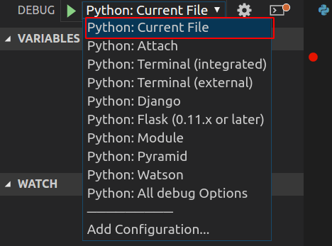
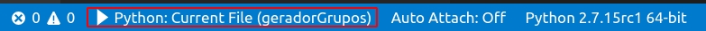
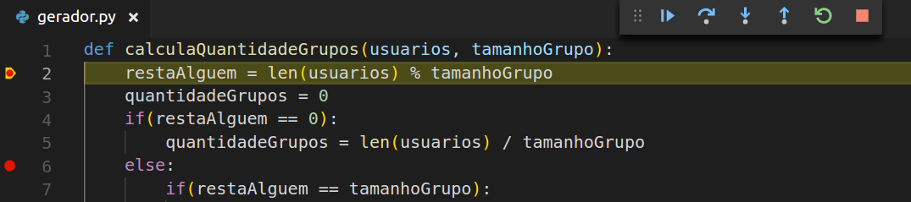

> Foto de capa tirada deste link [aqui](https://code.visualstudio.com/docs/python/python-tutorial)

Olá terráqueos, neste post super rápido vamos ver como debugar nossos códigos Python no Visual Studio Code, algo bem simples porém muito útil, então sem mais delongas vamos ao que interessa.  

Primeiro de tudo, você precisa ter o Python e o Vscode instalado, afinal né, o post é sobre isso ¯\_(ツ)_/¯. 

Se você já tem o Python e o Vscode instalado, vai precisar instalar a extensão do Python no vscode, para isso vá no menu de extensões, no lado esquerdo da tela (ou aperte CTRL + Shift + X) e procure por Python. Dos resultados que vão ser apresentados, você deve procurar pela extensão oficial da Microsoft, que deve ser a primeira e mais baixada. 

Agora selecione o menu de Debug, que fica acima do de extensões (ou aperte CTRL + Shift + D). Por padrão não há nenhuma configuração sendo utilizada, para resolver isso clique em "Configure or Fix launch.json" e escolha Python, como mostrado na imagem abaixo: 

 

Depois de realizar o passo acima, a extensão do Python que você instalou anteriormente, vai se encarregar de criar o **launch.json** que nada mais é do que um arquivo contendo várias configurações pré definidas para que você consiga rodar e debugar seus códigos. Caso queira você pode adicionar configurações ou alterar às já existentes presentes no arquivo. 

Agora volte ao menu de debug e escolha uma configuração para o debug, você vai ver várias configurações que vão bem além de apenas Python, como as configurações para Django e Flask, porém por hora vamos utilizar a primeira da lista, Python: Current File, como mostrado na imagem abaixo: 

 

Enquanto você estiver debugando, na barra de status será exibido a configuração que você escolheu para utilizar como na imagem abaixo: 

 

Agora tudo está pronto, adicione alguns break points em algum código seu e coloque ele para rodar (aperte F5), você vai ver algo como o da imagem abaixo: 

 

Você pode usar o menu que é exibido para avançar, parar ou pular para o próximo trecho de código, ou utilizar os atalhos, por exemplo para avançar ao próximo ponto é só apertar F11.

Então isso é tudo pessoal, como disse no começo, essa é uma dica rápido mais que espero que ajudem vocês. Até a próxima!

