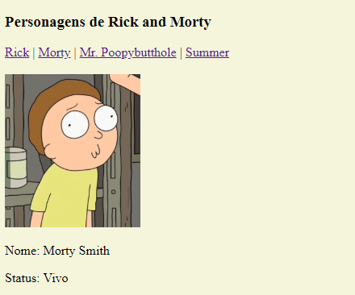

JavaScript vem mudando bastante ao longo dos últimos anos, sempre com a adição de novas e interessantes funcionalidades em cada novo release. Dentre outras várias mudanças, uma das coisas que vieram a partir do ES6, foi adição de uma nova forma de escrever strings, as Template Strings, e é justamente sobre isso que vamos falar hoje. 

Declarar Strings em JS não é nada diferente de outras linguagens, por exemplo, basta fazer algo como: 

```javascript
let nome = "João";
let nome2 = 'Maria';
```

Para criar uma string com várias linhas, seria necessário fazer algo como: 

```javascript
let strMultiLinha = 'linha1\n\
 linha2'
```

A string do exemplo acima só tem duas linhas, então é bem de boas de fazer, agora imagine ter que adicionar \n para uma string de 20 ou 30 linhas, seria um saco. 

Com Template Strings, sua string pode ter quantas linhas quiser, sem necessidade alguma de adicionar \n, exemplo: 

```javascript
let strMultiLinha = `linha1
linha2
linha3...`
```

O que define uma Template String é que elas não envolvidas por aspas, mas sim por acentos graves(``). 

Outra coisa bem bacana é o fato de ser possível interpolar texto e código JavaScript, de forma fácil e rápida, exemplo: 

```javascript
//Template Strings
let terraqueo = `Olá terráqueo ${nome}, como vai você?`
//String normal
let terraqueo = "Olá terráqueo " + nome + "como vai você?";
```

No exemplo acima você até pode dizer que não há muita diferença entre uma e outra, mas imagine que seu texto tem dezenas de linhas e mais algumas dezenas de variaveis que você deseja adicionar dinamicamente nele, algo como: 

```xml
<xa-datasource-property name="ServerName">${serverName}</xa-datasource-property>
<xa-datasource-property name="PortNumber">${porta}</xa-datasource-property>
<xa-datasource-property name="DatabaseName">${bancoAdm}</xa-datasource-property>
            
<xa-datasource-property name="User">${usuarioAdm}</xa-datasource-property>
<xa-datasource-property name="Password">${senhaAdm}</xa-datasource-property>
```

O código acima é apenas um trecho de um arquivo de configuração do JBoss que tem mais de 100 linhas, imagine ter que concatenar strings em cada campo desse arquivo, seria um pesadelo.  

Para demonstrar o poder das Template Strings, vamos criar um pequeno projeto, que vai exibir algumas informações de alguns personagens de Rick and Morty, dependendo de qual opção o usuário selecionar, tudo dentro de apenas um arquivo HTML. 

Para começar crie na sua máquina um diretório com o nome que deseja dar ao seu projeto, e adicione os arquivos index.html e index.js na raiz do projeto, além do arquivo principal.css dentro de /assets/css. 

O template base do index.html é o seguinte:

```html
<!DOCTYPE html>
<html lang="pt-br">
<head>
    <meta charset="UTF-8">
    <meta name="viewport" content="width=device-width, initial-scale=1.0">
    <meta http-equiv="X-UA-Compatible" content="ie=edge">
    <title>Teste</title>
    <link rel="stylesheet" href="assets/css/principal.css">
</head>
<body>
    <div class="main">        
        <h3>Personagens de Rick and Morty</h3>
        <nav id="nav-char">
            <a href="#" onclick="onChangePersonagem('Rick')">Rick</a> |
            <a href="#" onclick="onChangePersonagem('Morty')">Morty</a> |
            <a href="#" onclick="onChangePersonagem('Poopybutthole')">Mr. Poopybutthole</a> |
            <a href="#" onclick="onChangePersonagem('Summer')">Summer</a>
        </nav>
        <br>
        <div class="personagens">
            <p>Escolha um dos personagens</p>
        </div>
    </div>
    <script src="index.js"></script>
</body>
</html>
```

O principal.css não tem nada demais, apenas um código simples para mudar a cor de background e limitar o tamanho das imagens: 

```css
body {
    background-color: beige;
}

#imgPersonagem {
    width: auto;
    height: 190px;
}
```

Por falar em imagens, você pode encontrar as quatro que usei [aqui](https://drive.google.com/drive/folders/1XGIA51kLbHiTR42rpXD2flU0UyV4S5je?usp=sharing), basta extrair e salvar dentro de /assets/img. 

O index.js por sua vez, possui o seguinte código implementado:

```javascript
function onChangePersonagem(nome){
    var divPersonagens = document.querySelector(".personagens");
    if(nome === 'Rick'){        
        divPersonagens.innerHTML = modeloBase("Rick Sanchez", "Vivo", nome)
    }else if(nome === 'Morty'){
        divPersonagens.innerHTML = modeloBase("Morty Smith", "Vivo", nome)
    }else if(nome === 'Summer'){
        divPersonagens.innerHTML = modeloBase("Summer Smith", "Vivo", nome)
    }else {
        divPersonagens.innerHTML = modeloBase("Mr. Poopybutthole", "Morto", nome)
    }
}

function modeloBase(nome, status, nomeImagem){
    return `<div>
                
                <p>Nome: ${nome}</p>
                <p>Status: ${status}</p>
            </div>`
}
```

Como pode ser visto, em modeloBase(), a string criada não tem apenas texto, mas sim elementos HTML, esses elementos quando passados via InnerHTML, vão fazer com que a div seja criada  e exibida no index.html. 

Para testar basta acessar o index.html na raiz do projeto, se tudo funcionou como deveria você vai ver uma tela como essa: 



Não são só variaveis que você pode passar dentro das template strings, na verdade qualquer código JS pode ser passado dentro de ''${}'', como exemplo, o código abaixo faria a exibição das nossas quatro imagens em forma de tabela: 

```javascript
function listarEmTabela(){
    let table = `<table>
    <tr>
        <th>Foto</th>
        <th>Nome</th>
        <th>Status</th>
    </tr>
    ${listaPersonagens.map (personagem => {
        return `<td>${personagem.nomeImagem}.png</td>
                <td>${personagem.nome}</td>
                <td>${personagem.status}</td>    
        `
        }).join('')};
        <tr>
        </tr>
    </table>`;
    return table;
}    
```

Se você reparar bem, vai ver que não só passamos código JS dentro da template string, como também passamos um código que retorna outra template string (bem loko né!). No final para juntar tudo para retornar o resultado, basta utilizar a função join. Caso deseje o join aceita que seja passado um separador, porém no nosso caso aqui não é necessário. 

Se você já viu algo de React, deve ter percebido que nossa solução  é algo bastante parecido com o que ele faz com JSX, porém utilizando apenas JS. Para fins de comparação, veja um exemplo abaixo de código React: 

```react
let lista = React.createClass({
    render : function(){
        return (
            <ul>              
                {this.props.list.map(function(listValue){
            		return <li>{listValue}</li>        
                })}
            </ul>                                     
        )
    }
});
```

Outra coisa interessante sobre template strings é que você pode passar texto formatado (cheio de indentações 2 ou 4, dependendo do seu gosto kkk), que tudo será mantido sem problemas, tudo é preservado da forma como você informa. Por exemplo, veja o código abaixo: 

```javascript
let paragraph = 
`Paragraph:
    1. Point 1:
       1.1 Sub-point 1:
       1.2 Sub-point 2:
    2. Point 2:
       2.1 Sub-point 1:
       2.2 Sub-point 2:
    3. Point 3:
       3.1 Sub-point 1:
       3.2 Sub-point 2:
Conclusion: I'm exhausted! Did I miss anything?`;
console.log(paragraph);
```

Bem, acho que já deu para você ter uma ideia do que é possível fazer com template strings, então vou ficando por aqui, até a próxima! #Vlw #Flw