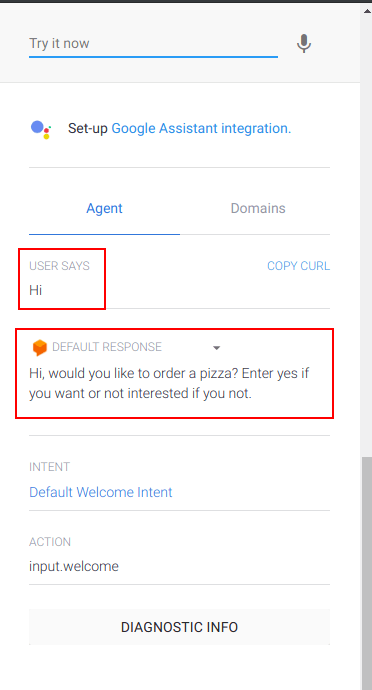
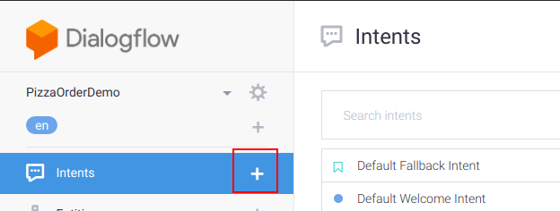
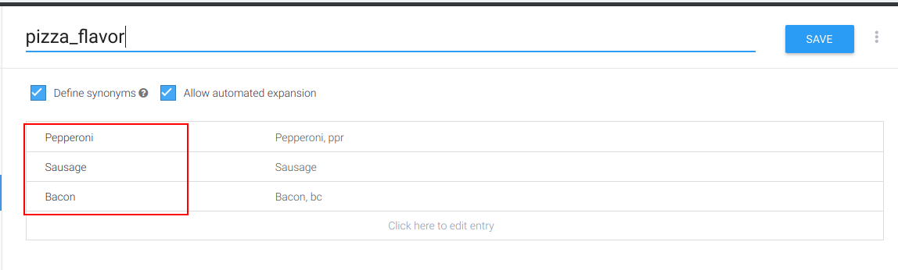
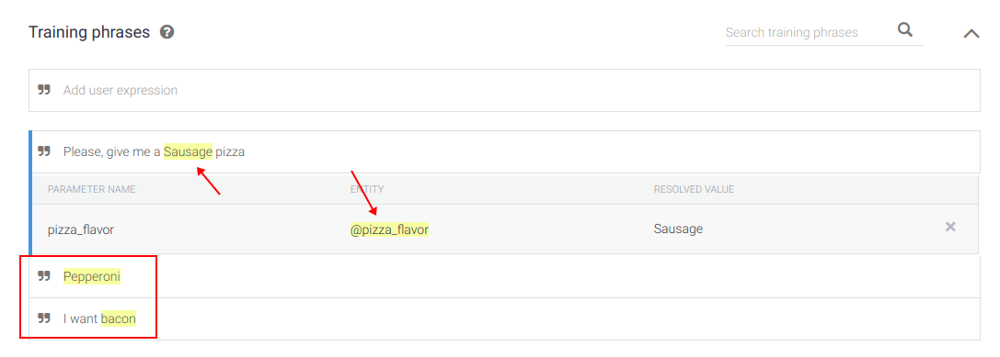
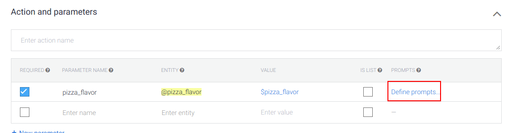
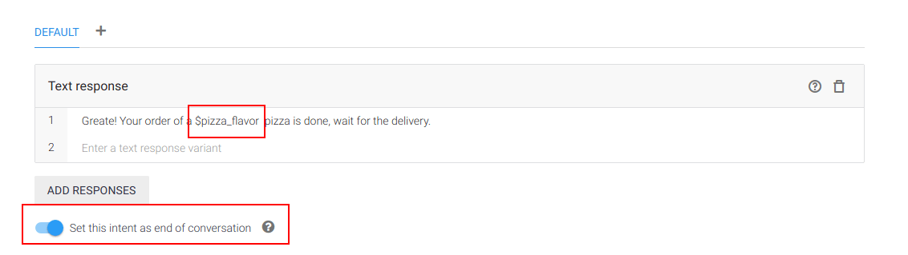

Hi guys, today I will talk about a very interesting thing called chatbot and how build one with DialogFlow, so I hope you enjoy. 

### What is a chatbot

According to [Oxford Dictionaries](https://en.oxforddictionaries.com/definition/chatbot), a chatbot is:

> **“A computer program designed to simulate conversation with human users, especially over the Internet.” 

You can may ask yourself, why I will want to make something to simulate a conversation with humans? For answer this, imagine a example where you have a web system for book cars. 

Your system is accessed daily for dozens of users, and for book a car or get information about something, the user need to talk with someone, like an attendant,  so how much users you have, more attendant will be required for a better service. 

But many users juts want book a car or may want  to know simple things like which cars are available, this type of interaction it's exactly the type which can be made by a chatbot.

Chatbot are a great option to improve the communication with your customers. Forgot things like "Stay on line, your call is very important for us" or searches in dozens of FAQ pages, users don't have time for this. A chatbot improve your response rate ensuring that everyone will be answered as quickly as possible. 

### First steps with DialogFlow

For this post we will create a chatbot to order pizza, where a consumer can order a pizza of three different flavors, but before we start, we need talk about agent, intents and entities, three things very important when working with DialogFlow. 

**Agent**: A agent is essentially the bot itself, think of a agent like a small kid, you have to teach him how to communicate and understanding. 

**Intents**: Generally a intent is a collection of sentences which have the same meaning and the bot know how to answer to. 

Inside a intent we have the training phrases and the responses. The first is a collection of sample sentences that we pass to the bot learn. Responses are a set of one or more phrases which will be presented as answers to training phrases. 

**Entities**: Entities according to the documentation is Entities is a mechanism for identifying and extracting useful data from natural language inputs.  When used together intents, allows for example, knowing the delivery address of a pizza order. 

Are three types of entities in DialogFlow, the system entities, developer entities and the user entities. 

1. **System entity**: These are pre-built entities provided by Dialogflow in order to facilitate handling the most popular common concepts like date, hour, numbers and others basic informations. 
2. **Developer entity**: Are entities created by the developers, to deal with the particularities of each system. For example, a bot used to book bikes, can have a entity to deal with the type of service, like tire change, repair or tune-up.
3. **User entity**: Are special type of entities, that can be defined for a specific user session. According to the documentation, an example for this is a scenario could be when you have a @playlist entity that has generic playlist. As playlists are user-specific, @playlist entity could be defined in a request or for a given session.

> It's possible create entities which are combinations of two or more others entities. 

Finished the part of the explanation, let's start with the practice, for this open the [DialogFlow page](https://dialogflow.com/) and select the option "Go To Console" on top right corner. When you do this, will be required authentication, one of options to made this is with a Google account. 

After login, it's time to create our first agent, for this is required to define the name, language and the timezone in my case i choose PizzaOrderDemo as the name and English as a language. 

When the process of creation ends, you will be redirect to the intents page and on this page you you will see there are already two intents created, the fallback and the welcome intent, these two guys made exactly what their names say. 

Open the welcome intent, you will see a lot of training phrases and responses, don't remove the training phrases, but remove all the responses and create a new response, something like:

> Hi, would you like to order a pizza? Enter yes if you want or not interested if you not.

Save your changes and click in Save button, a message will be appear, to tell you that the bot is training, wait a few seconds and we'll test our changes. First say something like hi or hello to receive the new welcome message, something like this: 

After this, say something weird and see what happens, one of the default responses defined in fallback intent will be displayed. When are more of one responses the system randomly chooses one of then to answer you. If you want, change the responses of fallback intent, in my case a remove all the defaults responses and create a new, like this: 

> I missed what you said. Would you like to order a pizza?

Now let's create a new intent to show the available pizzas to the user, for this click in the plus symbol on the intent menu:

Now we have to define three things, the name of intent (I called pizza_available), the training phrases and the responses. Feel free to define the training phrases and more of one response if you want, I defined just one.

>  We have pizza of Pepperoni, Bacon and Sausage.

Made the changes, save and test. 

Now let's create a intent to deal with order pizza, but in this intent we have a different thing, here we need to deal with the flavor chosen by the user, for this we need to create a entity. Click in the plus symbol on right side of Entities menu and click in Create Entity button. 

Now you need define the name of the entity and the values, something like this:

 

Save the changes and back to the order pizza intent. 

In order pizza intent, if you create a training phrase like "Please, give me a Sausage pizza", you will see that the sausage word will be recognized as a pizza_flavor entity, like this:

The flavor of pizza is a important information, so we can define that it's a  required information, for this scroll your page until "Action and parameters", and mark the required checkbox. 

Another good options for improve this behavior is define a prompt to ask the user when the flavor is not passed, for this click in "Define prompts" and write a phrase to be send

 

Now we need to define the answer for this intent, before explain I will show you how a define the my response: 

First thing, the **$pizza_flavor** in the text response was used to add dynamically in the response the type of pizza request by the user, this work like template string on JS for example, concatenating text and values. 

Second thing, the option "Set this intent as end of conversation" this made exactly what you think, after the response the dialog ends. 

Now let's create a intent to deal with the not interesting situation, no mystery here, add some training phrases like Not interesting, cancel, no and more, and one or more responses, but here the response need to end the conversation so mark the "Set this intent as end of conversation" option. 

Now save the changes and congratulations you have create your first bot, now it's time to test him a lot. So this is all folks, until next time!  

### Good places to learn more

[Docs](https://dialogflow.com/docs)

[BlondieBytes channel on YouTube](https://www.youtube.com/watch?v=yFyNouueu2g)

