Olá terráqueos, no post de hoje vamos ver como criar um bot utilizando o Hubot, um robô customizável e open source, criado e distribuído pelo GitHub. 

Antes de começar é necessário que você tenha o Node e o NPM instalados em sua máquina, para verificar, abra o terminal e digite os seguintes comandos: 

```shell
npm --version
node --version
```

Caso precise instalar um dos dois, você pode dar uma olhada em como fazer isso nesse tutorial da [Digital Ocean](https://www.digitalocean.com/community/tutorials/como-instalar-o-node-js-no-ubuntu-16-04-pt). 

Além do Node e NPM, também vamos instalar o Hubot e o Redis. O Redis é necessário pois é utilizado pelo Hubot para salvar dados. 

```shell
npm install -g yo generator-hubot
sudo apt update && sudo apt install redis-server
```

Com tudo devidamente instalado, crie uma pasta no diretório que desejar e acesse a pasta pelo terminal, dentro da pasta digite o comando abaixo: 

```shell
yo hubot
```

Serão feitas algumas perguntas a você, como o nome do bot e o adapter a ser utilizado. Sobre os adapters eis o que fala a documentação do Hubot: 

> “Adapters are the interface to the service you want your hubot to run on.”

No nosso caso vamos integrar o Hubot ao RocketChat, por isso quando questionado pelo adapter, responda “rocketchat”. Para as demais perguntas fique a vontade para responder da forma como quiser, além do adapter a única outra que fará grande diferença é o nome do bot, pois é por esse nome que ele será chamado.  

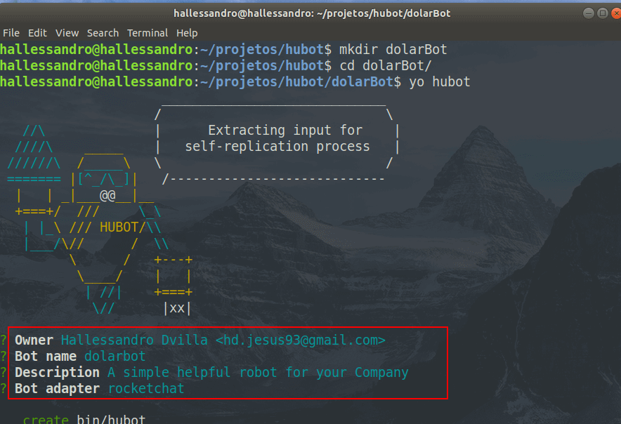

Para testar o bot recém criado, pelo terminal, acesse a pasta onde ele foi criado, e então digite o comando ./bin/hubot. Uma característica do Hubot, é que quando criado, ele não faz muita coisa, porém você checar o que ele é capaz de fazer por meio do comando abaixo: 

```shell
nome_do_bot help
```

Uma lista de comandos será apresentada, escolha um deles e execute para testar. 

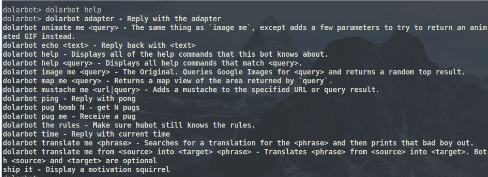

Apesar de não fazer grandes coisas logo após sua criação, o Hubot é extremamente moldável, o que permite que possa ser expandido para fazer as mais diversas funções. Como exemplo, dentro do GitHub ele é responsável por atuar como um agente ativo no processo de deploy do GitHub, como você pode ver nesse vídeo [aqui](https://www.youtube.com/watch?v=kCGeB3ewHyA).  

Esse processo onde um bot é integrado a um canal de comunicação, participando ativamente dos processos da empresa, recebe o nome de ChatOps, porém não vamos entrar muito em detalhes disto agora, pois seria um spoiler de outro post. :-D 

Abra a pasta onde o bot foi criado no seu editor de código preferido e vamos brincar um pouco com ele. 

Dentro da pasta, veja que existe uma subpasta chamada scripts, dentro dessa pasta é onde serão armazenados todos os scripts criados para aprimorar o seu bot. No Hubot são suportados dois tipos de arquivo, os .js e os .coffee. 

Para que um arquivo esteja dentro dos padrões do Hubot, basta que o mesmo  esteja dentro da pasta de scripts, que seja de um dos dois formatos supracitados e que exporte uma função, algo como: 

```javascript
module.exports = (robot) ->
  \\your code here
```

O parâmetro robot é uma instância do seu bot, ele sempre deve ser passado nas funções criadas. 

O nosso bot criado com Hubot, nada mais é do que um chatbot, e como um, as duas interações mais simples que ele deve ser capaz de realizar são ouvir e responder, para isso o Hubot disponibiliza os métodos hear e respond. Uma caracteristica de ambos os métodos é que eles recebem como parâmetros uma expressão regular e uma função de callback, como no exemplo abaixo, tirado diretamente da documentação oficial: 

```javascript
module.exports = (robot) ->
  robot.hear /badger/i, (res) ->
    \\your code here

  robot.respond /open the pod bay doors/i, (res) ->
	\\your code here
```

O método **robot.hear** é acionado sempre que uma mensagem de texto combinar com o padrão, como nos exemplos abaixo: 

1. Stop badgering the witness
2. badger me 
3. what exactly is a badger anyways

Já o método **robot.respond** é chamado por mensagens que combinem com o padrão passado como parâmetro e sejam precedidas pelo nome ou alias do bot. Supondo que o nome do bot é HAL e o alias /, o método em questão retornaria algo, para os seguintes exemplos: 

1. hal open the pod bay doors
2. HAL: open the pod bay doors
3. @HAL open the pod bay doors
4. /open the pod bay doors

A documentação completa sobre o que é possível fazer com scripts no Hubot, pode ser vista [aqui](https://hubot.github.com/docs/scripting/). 

Neste post vamos focar na capacidade de fazer requisições HTTP, para consumir uma API que retorne informações sobre a cotação atual de algumas moedas. 

O Hubot é capaz de trabalhar com requisições HTTP por meio do robot.http, que nada mais do que uma instância node-scoped-http-client. Um simples exemplo é: 

```javascript
 robot.http("https://midnight-train")
    .get() (err, res, body) ->
      \# your code here
```

Antes de começar a implementar o código para consumo da API de cotação de modeas, vamos configurar o RocketChat, para isso você vai precisar do Docker, caso não tenha instalado, dê uma olhada nesse tutorial [aqui](https://www.digitalocean.com/community/tutorials/como-instalar-e-usar-o-docker-no-ubuntu-16-04-pt) da DigitalOcean. 

Para instalar o RocketChat você vai precisar executar dois comandos, um para obter a imagem do MongoDB, utilizado pelo RocketChat e outro para obter a imagem do próprio chat, ambos seguem listados abaixo: 

```shell
sudo docker run --name db -d mongo:3.0 --smallfiles
sudo docker run --name rocketchat -p 80:3000 --env ROOT_URL=http://localhost --link db -d rocket.chat
```

Depois que tudo for finalizado, acesse o localhost/ para ter acesso a sua instância do RocketChat. Antes de começar a utilizar o chat, você vai precisar realizar algumas configurações, nada demais, basta seguir o que é mostrado nas quatro telas abaixo: 

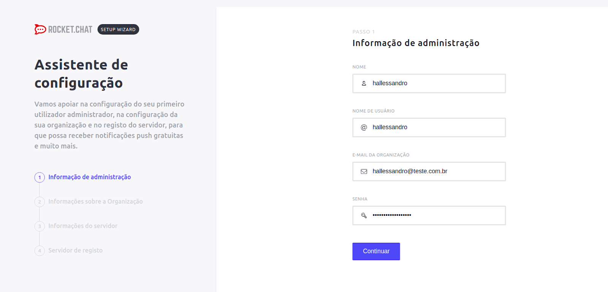

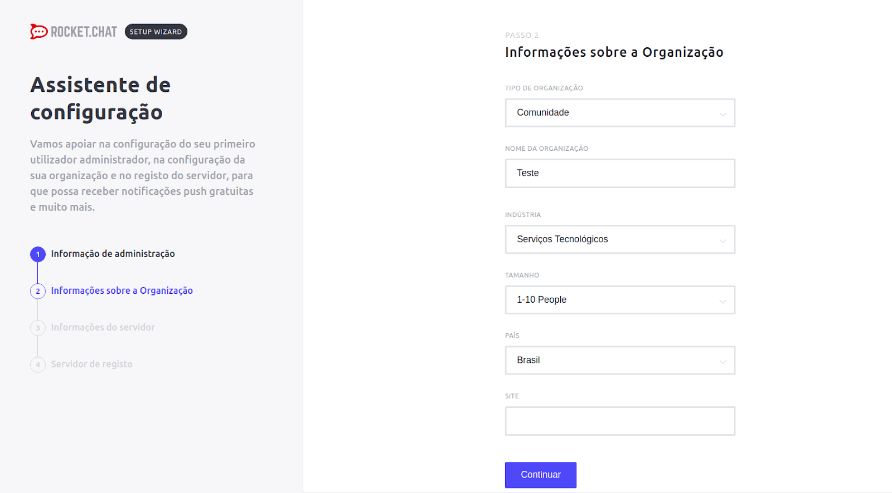

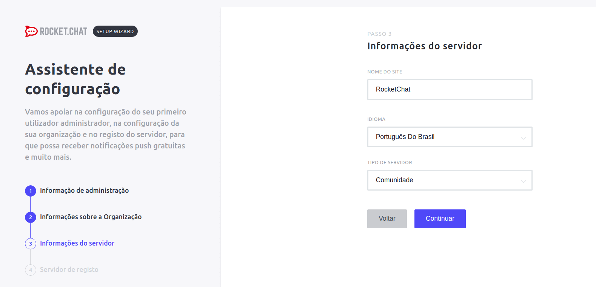

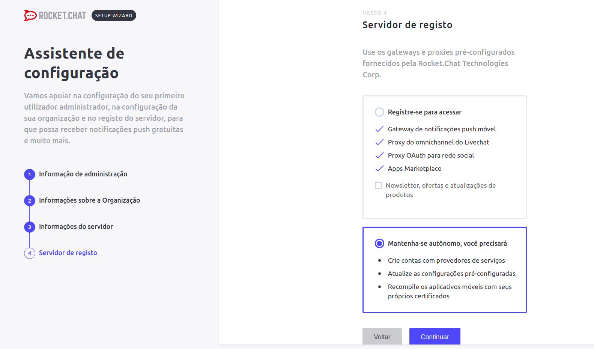 

 

Com o RocketChat devidamente configurado vamos criar um usuário para o nosso bot, ele vai precisar para conseguir acessar o chat, para isso acesse o menu de Administração: 

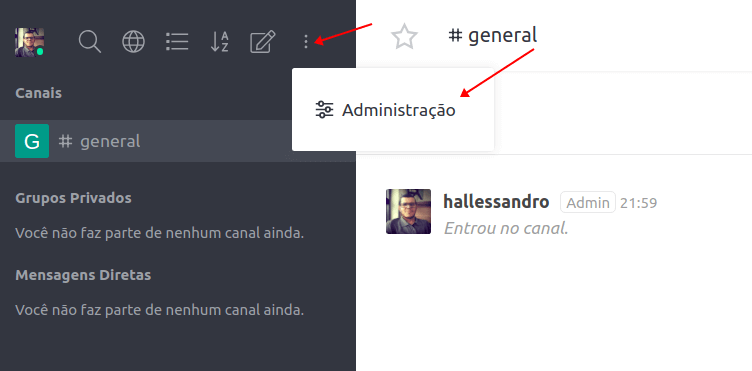

Acesse a parte de usuários, clique no + e preencha o cadastro conforme na imagem abaixo: 

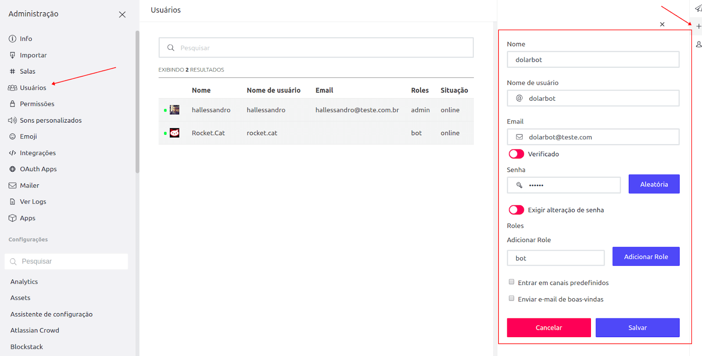

É importante que o papel seja o de bot e que não seja exigido troca de senha do nosso bot. 

Agora vamos fazer com o bot seja capaz de se conectar ao RocketChat, para isso crie o arquivo .env na raíz do projeto com o seguinte conteúdo: 

```javascript
export ROCKETCHAT_URL=localhost:80 #Caminho e porta da nossa instância do RocketChat
export ROCKETCHAT_USER=hubot #Usuario de acesso ao rocketchat
export ROCKETCHAT_PASSWORD=esighallessandro93 #Senha de acesso ao rocketchat
export ROCKETCHAT_ROOM=general
export ROCKETCHAT_USE_SSL=false
export ROCKETCHAT_ROOM=''
export LISTEN_ON_ALL_PUBLIC=true #Informa que o bot tem acesso a todos os canais públicos
```

Agora abra o arquivo hubot que fica dentro de bin, e na linha exec adicione -a “rocketchat” logo depois do --name. 

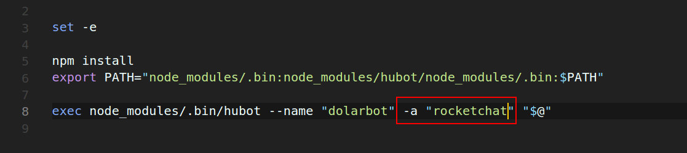

No terminal execute o comando source .env e então ./bin/hubot, ao fazer isso volte ao RocketChat e veja que o usuário do seu bot está online. Mande uma mensagem para ele no canal General que já está criado, algo como dolarbot help ou ping. 


Agora vamos implementar o script para consumo da api de moedas, por meio da criação do arquivo cotacao.js na pasta de scripts. Um ponto importante sobre a criação de scripts é que eles podem ser facilmente documentados por meio de comentários no topo dos arquivos. Lembra do comando hubot help? Quando ele é executado o hubot vai ler os seus comentários para verificar quais comandos estão disponíveis e retornar na chamada do help. 

O padrão de comentários do Hubot é o seguinte: 

```javascript
// Description:
//   <description of the scripts functionality>
//
// Dependencies:
//   "<module name>": "<module version>"
//
// Configuration:
//   LIST_OF_ENV_VARS_TO_SET
//
// Commands:
//   hubot <trigger> - <what the respond trigger does>
//   <trigger> - <what the hear trigger does>
//
// Notes:
//   <optional notes required for the script>
//
// Author:
//   <github username of the original script author>
```


Desses o Commands é o mais importante e o que é processado em tempo de execução para verificar quais comandos estão disponíveis. 

Vamos começar nossa implementação criando um método para listar todas as moedas disponíveis para consulta, para isso você pode fazer algo como: 

```javascript
    robot.respond(/moedas dispon(i|í)veis/, res => {
        res.reply(` segue a lista: 
            USD-BRL (Dólar Comercial)
            USD-BRLT (Dólar Turismo)
            CAD-BRL (Dólar Canadense)   
            EUR-BRL (Euro)
            GBP-BRL (Libra Esterlina)
            ARS-BRL (Peso Argentino)
            BTC-BRL (Bitcoin)
        `)
    })
```


Agora reinicie o hubot e volte ao RocketChat para testar o novo comando disponível. 

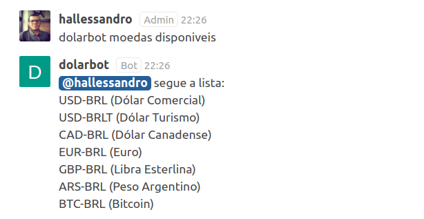

Agora vamos criar o método para consumo da api de moedas, o endereço da api que vamos utilizar é o seguinte: 

http://economia.awesomeapi.com.br/json/${moeda}/1

A documentação oficial da API pode ser encontrada [aqui](https://docs.awesomeapi.com.br/api-de-moedas). 

Primeiro crie o robot.respond com a expressão regular que deseje que acione o método, depois na função de callback, será feito a requisição HTTP por meio de robot.http(URL).get(). O .get() vai ser responsável por tratar algum erro que venha a ocorrer e responder o usuário com o valor de compra da moeda. 

O código final do método fica da seguinte forma: 

```javascript
    robot.respond(/cota(c|ç)(a|ã)o do (.*)/, res => {
        let moeda = res.match[3]; 
        robot.http(`http://economia.awesomeapi.com.br/json/${moeda}/1`)
            .get() ((err, resp, body) => {
                if(err) res.reply("houve um erro na comunicação com API, tente de novo!")

                let resultado = JSON.parse(body);
                res.reply(`R$ ${resultado[0].bid}`);
            })
    });
```

Repare que para capturar qual a moeda informada foi feito um res.match[3], o três aqui é a posição do valor da moeda. O valor da posição zero é a mensagem inteira, já na posição um temos o resultado do primeiro parênteses, que testa em c e ç, já na posição dois, o valor é o do segundo parênteses. 

Em res.reply estamos retornando o valor da posição zero de resultado, pois o JSON que veio no body é um array que pode ter mais de um valor. A quantidade é definida pelo parâmetro 1 no final da URL, quanto maior o número, mais cotações serão recuperadas, como só temos uma podemos tranquilamente pegar apenas o valor da posição zero. 

Com tudo feito, reinicie o seu bot e acesse o chat, requisitando a ele a cotação de alguma moeda, se tudo deu certo, você vai receber o resultado esperado, como na imagem abaixo: 

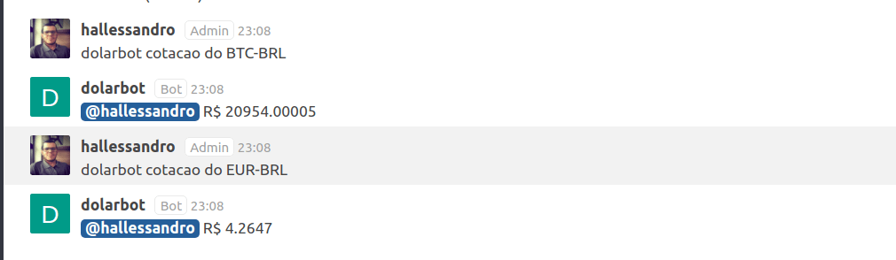

O código fonte do bot criado durante esse post pode ser encontrado no meu GitHub, no repositório [dolarBot](https://github.com/Hallessandro/dolarBot). 

Por hoje é tudo pessoal, porém esse é um assunto com bastante potencial e em breve voltarei com mais coisas relacionadas, então até a próxima. 

