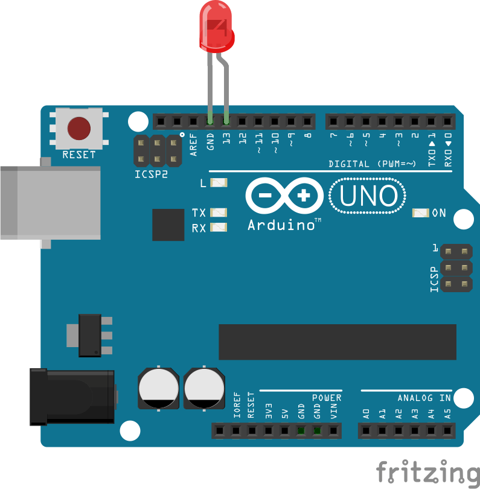

Sup guys, I'm back, this time to talk about Johnny Five, a JavaScript plataform for IoT and Robotic. In this post we will see how to control a Led by HTTP request.

Before we start, for this post It Is necessary that you have an Arduino and at least one Led. 

Let's start installing Johnny-Five and your requirements: 

```javascript
apt-get install nodejs-legacy
apt-get install build-essential
npm install serialport
npm install johnny-five
```

Now open your text editor and create a new .js file and paste the following code:

```javascript
var five = require("johnny-five"),
    board = new five.Board();

board.on("ready", function() {
  // Create an Led on pin 13
  var led = new five.Led(13);

  // Strobe the pin on/off, defaults to 100ms phases
  led.strobe();
});
```

Connect your Arduino on PC, and the Led in Arduino this way: 



Now on terminal, run the folowing command:

```shell
sudo node strobe.js
```

If everything ok, your Led will light up. :-D 

Now let's make things more fun. Create a folder in your machine and execute npm init on this folder. After install the Express, with the following command: 

```shell
npm install --save express
```

Create a new JS file called controller.js, and in this file, import the Express and the Johnny Five 

```javascript
const express = require("express");
const five = require('johnny-five'); 
const app = express();
```

Now create the following variables, to deal with de board and the status of Led:

```javascript
var board = new five.Board();
var isReady = false;
var isOn = false;
var led;
```

Put your Express server to run, this way:

```javascript
app.listen(3000, () => {
    console.log("Servidor rodando na porta 3000");
});

app.use(function(req, res, next) {
    res.header("Access-Control-Allow-Origin", "*");
    res.header("Access-Control-Allow-Headers", "*");
    next();
});
```

Now define a route to receive GET Requests: 

```javascript
app.route("/")
    .get((req, res) => {
        toggleLed();
        res.json({status: isOn});
});
```

When the board Is ready, It's necessary something to deal with it, for this add the following code on the controller.js:

```javascript
board.on('ready', function() { 
    // Define the pin 13 to be used
    led = new five.Led(13);
    // Turn off the Led
    led.off();
    // save the actual state of the Led
    isReady = true; 
});
```

Now add the code for the toggleLed() method, called in the app.route.

```javascript
function toggleLed () {
    // If the Led is on
    if (isOn) {
        //Turn off the Led
        led.off();
        isOn = false;
    } else {
        //Turn on the Led
        led.on();
        isOn = true;
    }
} 
```

The complete code can be found on my GitHub [here](https://github.com/Hallessandro/led-controller/blob/master/index.js).

Now on terminal run the folowwing command:

```shell
sudo node controller.js
```

Access **localhost:3000** on browser and see the magic happening. 

To improve our experience, let's create a client application for turn on/off the led. Create a new folder on your machine, and create the folder img, and the files index.html, index.css and index.js. 

Inside the folder img, add the images [here](https://github.com/Hallessandro/led-controller-client/tree/master/img).

On the css file, add the following code: 

```css
.div-buttons {
    display: flex;
    justify-content: center;
    padding-top: 20%;
}

.buttons {
    width: auto;
    height: 140px;
}

.img-led {
    height: 70px;
    width: auto;
}

.title {
    display: flex;
    justify-content: center;
}

#text-led {
    font-family: Arial, Helvetica, sans-serif;
    font-size: 20pt;
    text-transform: uppercase;
}

body {
    background-color: beige;
    background-image: linear-gradient(to right,#e5e5ff, #ccccff);
}
```

Inside the html file, add the following code:

```html
<!DOCTYPE html>
<html lang="en">
<head>
    <meta charset="UTF-8">
    <meta name="viewport" content="width=device-width, initial-scale=1.0">
    <meta http-equiv="X-UA-Compatible" content="ie=edge">
    <link rel="stylesheet" href="index.css">
    <title>Led Controller</title>
</head>
<body>
    
    <div class="title"></div>
    <div class="div-buttons"></div>
    
    <!-- Used to made HTTP request -->
    <script src="https://unpkg.com/axios/dist/axios.min.js"></script>
    <script src="index.js"></script>
</body>
</html>
```

Now on the js file, let's create a function to made get requests to our api, using the axios library, imported in our html file:

```javascript
function consultarStatusLed(){
    let url = 'http://localhost:3000/';

    axios.get(url, conf)
        .then(function (response) {
            changeButtons(response.data.status);
        })
        .catch(function (error) {
            // handle error
            console.log(error);
        })
}
```

Now create a function to request the change of the state of the Led, and change the button on page, for this add the following code:

```javascript
const $ = document.querySelector.bind(document);

function changeButtons(valor){
    if(valor == false){
        $(".div-buttons").innerHTML = `<input type="image" src="img/on.png" class="buttons" onclick="mudarStatusLed()">`;        
        $(".title").innerHTML = `
            
            <h3 id="text-led" style='color:green'>Led Controller</h3>
            
        `;
    }else {
        $(".div-buttons").innerHTML = `<input type="image" src="img/off.png" class="buttons" onclick="mudarStatusLed()">`;        
        $(".title").innerHTML = `
            
            <h3 id="text-led" style='color:red'>Led Controller</h3>
            
        `;
    }
}

function mudarStatusLed(){
    consultarStatusLed();
}
```

Lastly add a call to consultaStatusLed() on the end of the file: 

```:3rd_place_medal:
consultarStatusLed();
```

> The complete code can be found in my GitHub [here](https://github.com/Hallessandro/led-controller-client).

Save everything and let's test. Open index.html in a browser and click the on / off button a few times, if everything went well, the result will be as show in the video link below:

[Resultado final](https://youtu.be/3aM8F9GW1RA)

That's all folks, until next time! 

