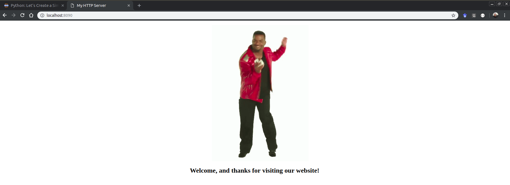

Hey guys, my name is Hallessandro, I am a software developer that currently works and live in Brazil, and in this post I will show you how to create a HTTP server using Python, so let's get start. 

### Requirements

For this post, you will need Python 3.x installed in your machine and some text editor or IDE of your preference.

### Create a HTML file

Our HTTP server will server a simple static HTML web page, this means that every time someone made us a request, the HTTP server will return a HTML page as response. Create a new HTML file in your machine and put the following code inside it. 

```html
<!DOCTYPE html>
<html lang="en">
<head>
    <meta charset="UTF-8">
    <meta name="viewport" content="width=device-width, initial-scale=1.0">
    <meta http-equiv="X-UA-Compatible" content="ie=edge">
    <title>My HTTP Server</title>
    <style>
        .img-div {
            display: flex;
            justify-content: center;
        }
        h2 {
            text-align: center;
        }
    </style>
</head>
<body>
    <dir class="img-div">
        
    </dir>
    <h2>Welcome, and thanks for visiting our website!</h2>
</body>
</html>
```
I put a image on our page, so click [here](https://drive.google.com/open?id=13y3KDwTcgt6vZt-4m0sHN66AcDy2DDx4) and download the image called **tenor.gif**. You need to put the image in the same folder of the HTML file, or change the src value on the img tag. 

### Create a HTTP server

For create a HTTP server in Python, you will need import two modules, **http.server** and **socketserver**

```python
import http.server
import socketserver as socket
```
Now we need a way to deal with the http request, and for this, to our luck, Python has the **http.server.SimpleHTTPRequestHandler**, a simple handler that serves static files from the current directory. For use this guy, make something like this: 

```python
handler = http.server.SimpleHTTPRequestHandler
```
We have a handler to deal with the http request, but now we need to put our server on air, for this we need to use the TCP protocol. In Python is very simple (Like everything else in Python) to open a TCP connection, all we need is use the **socketserver.TCPServer class.**, like this:

```python
socketserver.TCPServer((IP_ADDRESS, PORT), Handler)
```
As you can see, the TCPServer receives three arguments, the ip address and port as a tuple, and the handler, that in our case is a instance of SimpleHTTPRequestHandler. 

The Ip address is not a required information, you can pass a empty string, this means that the server will be listening on any network interface available.

Now all we need to do is put the server to run, for this, inside the TCPServer, we need to call a method called serve_forever() from the TCPServer class, this method start a server and begins listening and responding to incoming request, for use them, make something like this: 

```python
with socket.TCPServer(("", PORT), handler) as httpd:
    print("Server is running on port ", PORT)
    httpd.serve_forever()
```
Now let's test, for this, run the python file from your terminal, if everything is ok, you will see something like this, on the console: 

```
Server is running on port  8090
```
Now open a web browser and access the url localhost:8090, a page like this will be show: 



If you see on your console will be a log to the GET request receive, generated when you access the page on web browser. 

```
127.0.0.1 - - [22/Jan/2019 22:27:32] "GET / HTTP/1.1" 200 -
127.0.0.1 - - [22/Jan/2019 22:27:32] "GET /tenor.gif HTTP/1.1" 200 -
```

The complete code for this example is this:

```python
import http.server
import socketserver as socket

PORT = 8080
handler = http.server.SimpleHTTPRequestHandler

with socket.TCPServer(("", PORT), handler) as httpd:
    print("Server is running on port ", PORT)
    httpd.serve_forever()
```
In a real case your server will not just server static html files, but for example purpose, this is a good way to understand how to do this in Python, so for now is all folks, thanks for reading, feel free to contact me and until next time guys. 
