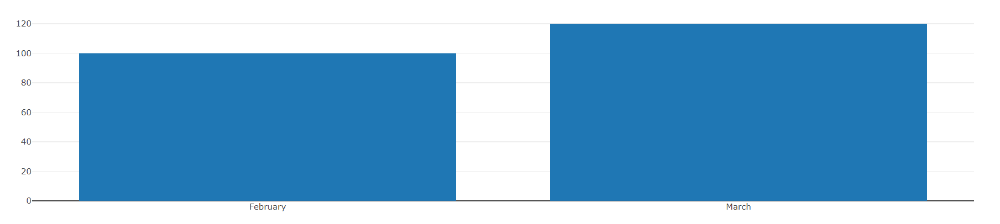
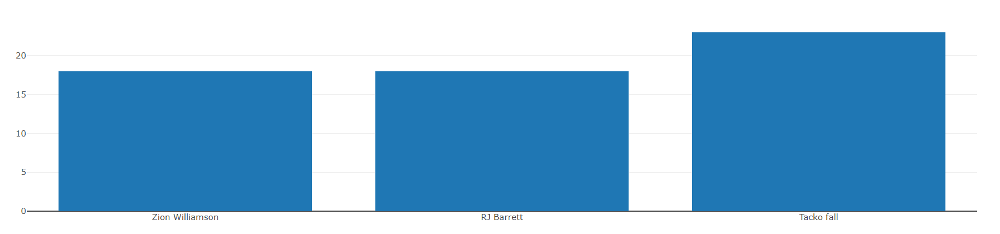
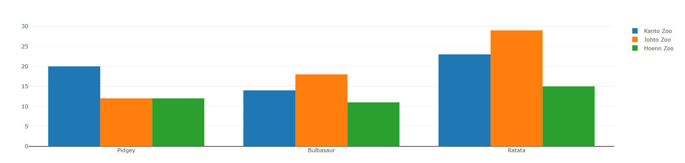
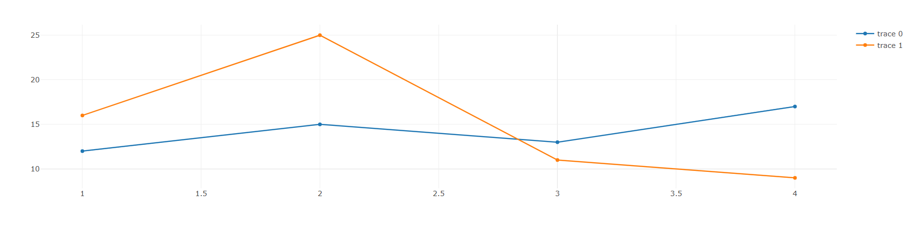
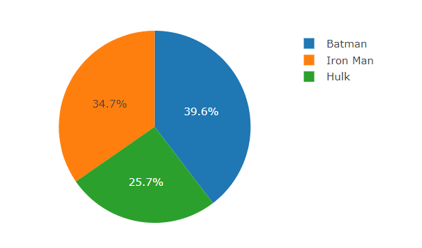

Charts can be a great way to present information of a way that a reader can be understanding fast and easy. For example, if you want to say that in March your sales were 20% higher than in February, instead to say this in one or two paragraphs of text you can show this in a simple chart bar like this: 



There's a lot of option of libraries of charts in JavaScript, like ChartJS, Google Chart, Chartist.js and others. If you want to know more about these libraries, you can check [this](https://www.sitepoint.com/15-best-javascript-charting-libraries/) article on SitePoint.  

In this post I will talk about [Plotly.js](https://plot.ly/javascript/ ), a open source graphing library  with support to 20 different types of charts, 2D and 3D. 

First of all create a folder in your machine and in this folder add the file index.html. This file will be our base file and your content for now is this: 

```html
<!DOCTYPE html>
<html lang="en">
<head>
    <meta charset="UTF-8">
    <meta name="viewport" content="width=device-width, initial-scale=1.0">
    <meta http-equiv="X-UA-Compatible" content="ie=edge">
    <title>Using Plotly JavaScript</title>
</head>
<body>
    <div id="myDiv"></div>
</body>
</html>
```

Now we need to add the Plotly in our project, for this are 2 ways, CDN or download the JS file. I prefer use the download version, but in this post we will use CDN, because is more simple and don't need no download. 

Both options can be found in [this page](https://plot.ly/javascript/getting-started/).

For add Plotly to our project, just add the following content in the end of the body tags in the index.html.

```html
<script src="https://cdn.plot.ly/plotly-latest.min.js"></script>
```

Now let's create a JS file to deal with the process of creation of charts, I will call this file of index.js. It's important to say, that you will need to import the file created in the index.html, for this add a script src tag below the script import of Plotly. 

```html
<script src="https://cdn.plot.ly/plotly-latest.min.js"></script>
<script src="index.js"></script>
```

Note that in our index.html file there is a div called **myDiv**, this element will be used to render the charts. 

Now let's get start to create some charts. In this post we will explore a little about 3 charts very common, bar, pie and line charts.

### Bar Charts

For create a bar chart we need to pass two different groups of values, the values for the X and Y axis and pass the type of chart we want. For this we can create something like this:

```javascript
var data = [
  {
    x: ['Zion Williamson', 'RJ Barrett', 'Tacko fall'],
    y: [18, 18, 23],
    type: 'bar'
  }
];
```

Now for create the chart all we need to do is called the method newPlot() of the Plotly libraries passing the id of a element where the chart will be render, and the data value to put in the chart, something like this: 

```html
Plotly.newPlot('myDiv', data);
```

Now open the index.html on a browser and the result will be like this: 



It's possible too create more sophisticated bar charts using Plotly, for example we can create a grouped bar chart, for this change the index.js code for this: 

```javascript
var trace1 = {
    x: ['Pidgey', 'Bulbasaur', 'Ratata'],
    y: [20, 14, 23],
    name: 'Kanto Zoo',
    type: 'bar'
  };
  
  var trace2 = {
    x: ['Pidgey', 'Bulbasaur', 'Ratata'],
    y: [12, 18, 29],
    name: 'Johto Zoo',
    type: 'bar'
  };
  
  var data = [trace1, trace2];
  
  var layout = {barmode: 'group'};
  
  Plotly.newPlot('myDiv', data, layout);
```

The big difference here is that we passing the layout object to newPlot() method. The function of the layout object is to say that the chart create will be a group of bar charts. 

You can create groups of bar charts with more than 2 data objects, for this just add the another data to the array of data that will be passed in the newPlot method call. For example you can create a group of 3 bar charts.

```javascript
var trace1 = {
    x: ['Pidgey', 'Bulbasaur', 'Ratata'],
    y: [20, 14, 23],
    name: 'Kanto Zoo',
    type: 'bar'
  };
  
  var trace2 = {
    x: ['Pidgey', 'Bulbasaur', 'Ratata'],
    y: [12, 18, 29],
    name: 'Johto Zoo',
    type: 'bar'
  };

  var trace3 = {
    x: ['Pidgey', 'Bulbasaur', 'Ratata'],
    y: [12, 11, 15],
    name: 'Hoenn Zoo',
    type: 'bar'
  };
  
  var data = [trace1, trace2, trace3];
  
  var layout = {barmode: 'group'};
  
  Plotly.newPlot('myDiv', data, layout);
```



There is much more that you can do with Plotly bar charts, if you are curious about this, check the documentation in [this link](https://plot.ly/javascript/bar-charts/).

### Line Charts

One of the most cool things about Plotly, is the fact of that the code to create charts is very similar between different types of charts. To create a line chart we will see that the code is very similar with the code to create a grouped bar chart. 

First we need to create our two or more datasets, and the difference here is the type that will be scatter instead of bar. 

```javascript
var line1 = {
  x: [1, 2, 3, 4],
  y: [12, 15, 13, 17],
  type: 'scatter'
};

var line2 = {
  x: [1, 2, 3, 4],
  y: [16, 25, 11, 9],
  type: 'scatter'
};

var data = [line1, line2];
```

Now all we will need to do is pass the data object to the newPlot() method, like this: 

```javascript
Plotly.newPlot('myDiv', data);
```

The result will be like this: 



As you can see there is not much difference in the process to create a line chart, but like the bar chart, the line chart have a lot of options to improve the chart, so if you want know more about line charts with Plotly, check [this](https://plot.ly/javascript/line-charts/).

### Pie Chart

To create Pie Chart the data object is a little different of the other two examples, because pie charts don't use axis X & Y, in this type of chart you just have the values and the labels of this values, so let's create a data object with some random data:

```javascript
var data = [{
  values: [40, 26, 35],
  labels: ['Batman', 'Hulk', 'Iron Man'],
  type: 'pie'
}];
```

Now let's create a layout object to define the height and width of our chart. I don't know if you note this, but our two previous examples are created without define the height and width properties, this will made with that the charts use 100% of the available space on the screen. 

```javascript
var layout = {
  height: 400,
  width: 500
};
```

Now all we need to do, is call the newPlot() method, passing our data and layout object, like this:

```javascript
Plotly.newPlot('myDiv', data, layout);
```

The result will be like this:



Another option to pie chart is the donut chart. The difference between this two charts is that the donut chart has a empty space in the center like a real donut.

### Why Plotly?

You see in this post that create charts with Plotly is a very simple task, but if you already test another options of libraries of charts in JS, the another options can be as simple as Plotly, so you can ask yourself about why I should be use this? 

The answer for this is simple, Plotly is not just a simple chart library, what you see in this post, is just the basic of this thing, with Plotly you can do basic and commons charts, but you can do too **statistical charts**(Error bars, 2d density plot, histogram),  **scientific charts**(heatmaps, contour plots), financial charts, maps, 3d charts and a lot of other things. 

So if you need a complete library to deal with very advance charts or if you need create just a basic bar charts, maybe Plotly can be a way for you.

This is all folks, I expect that this can be useful for you guys, and see you in the next post. 